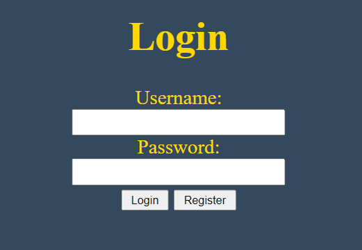
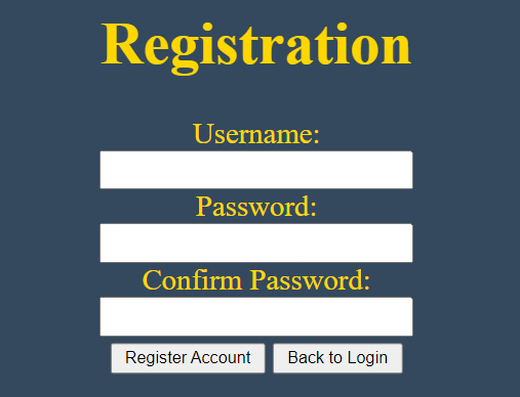

# Login & Registration Page
A Basic Website Login Page that allows you to Login or Register an account interacting with an SQLITE3 Database for storing

Use an application such as XAMPP to host the website on your local network for PHP to run.
Linux is recommened in this case.

Run the following commands in linux targeting the folder containing the website source files

[~] sudo chmod 777 [folder]

[~] sudo chmod 777 [folder/Login-Data.db]

This is to allow the SQLITE3 Database file to enable write-mode for Logging In and Registering.

